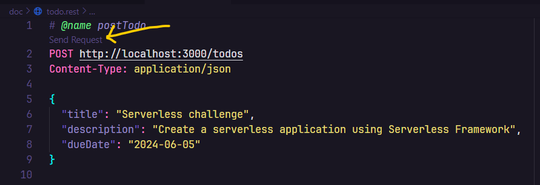

# Serverless Todo

## Requirements
- Node 18
- Docker CLI
- AWS credentials configured in your machine - *It's required by serverless framework, nothing will be created/read in your AWS account*
- [REST Client](https://marketplace.visualstudio.com/items?itemName=humao.rest-client) vscode plugin - *Optional, but it's a good tool to test the API*

## Run project
Install pnpm if you don't have it installed  
`$ npm i pnpm -g`

Install dependencies  
`$ pnpm install`

Run project for development  
`$ pnpm dev`

## Testing Web API
Open the file `doc/todo.rest` and click on `Send Request` button to test the API if you installed the REST Client plugin.  
You still use the file as reference to test the API using another tool.    

Look at the image  

